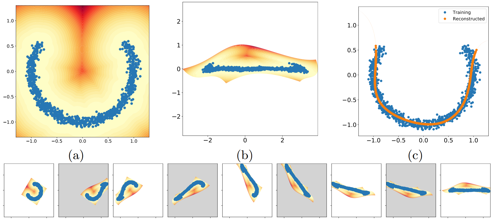

# Learning Non-Linear Invariants

Code used for our paper ["Learning Non-Linear Invariants for Unsupervised Out-of-Distribution Detection"](https://arxiv.org/pdf/2407.04022), accepted at the European Conference on Computer Vision 2024.



This repository contains the code to train our volume-preserving networks for finding non-linear invariants.

### Abstract

 The inability of deep learning models to handle data drawn from unseen distributions has sparked much interest in unsupervised out-of-distribution (U-OOD) detection, as it is crucial for reliable deep learning models. Despite considerable attention, theoretically-motivated approaches are few and far between, with most methods building on top of some form of heuristic. Recently, U-OOD was formalized in the context of data invariants, allowing a clearer understanding of how to characterize U-OOD, and methods leveraging affine invariants have attained state-of-the-art results on large-scale benchmarks. Nevertheless, the restriction to affine invariants hinders the expressiveness of the approach. In this work, we broaden the affine invariants formulation to a more general case and propose a framework consisting of a normalizing flow-like architecture capable of learning non-linear invariants. Our novel approach achieves state-of-the-art results on an extensive U-OOD benchmark, and we demonstrate its further applicability to tabular data. Finally, we show our method has the same desirable properties as those based on affine invariants.

### Citation

If you find this work helpful, consider citing it using

```
@article{doorenbos2024learning,
  title={Learning non-linear invariants for unsupervised out-of-distribution detection},
  author={Doorenbos, Lars and Sznitman, Raphael and M{\'a}rquez-Neila, Pablo},
  journal={arXiv preprint arXiv:2407.04022},
  year={2024}
}
```
